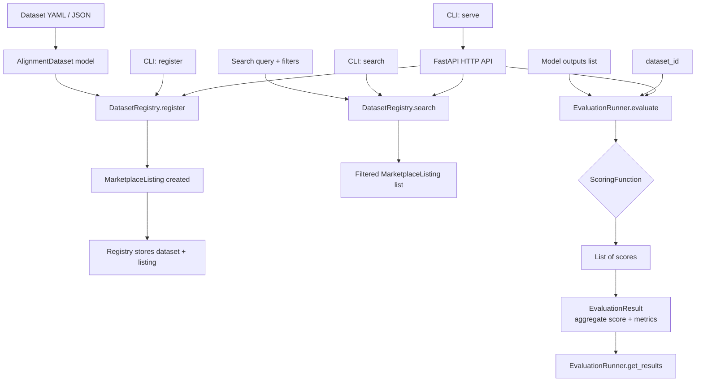

# aumai-alignment

A marketplace for AI alignment datasets and evaluations. Publish datasets, discover
curated evaluation suites, and benchmark AI models against alignment criteria — all from
a single Python library and CLI.

[](https://github.com/aumai/aumai-alignment/actions)
[](https://pypi.org/project/aumai-alignment/)
[](LICENSE)
[](https://python.org)

---

## What is this?

Imagine a library catalog — but instead of books, the shelves hold datasets designed to
test whether AI systems behave in aligned, safe, and beneficial ways. aumai-alignment is
the infrastructure for that catalog: a registry where researchers publish evaluation
suites, practitioners discover them by searching on tags or categories, and engineers
run standardized benchmarks to compare how different models score.

The three core concepts:

**AlignmentDataset** — A named, versioned collection of evaluation samples. Each dataset
has a category (e.g., "helpfulness", "harmlessness"), a quality score assigned by the
curator, a license, and optional download URL.

**MarketplaceListing** — A dataset wrapped in marketplace metadata: download count,
average rating, and review count. This is what gets returned when you search.

**EvaluationResult** — The outcome of running a model against a dataset. Contains an
aggregate score, min/max/mean breakdowns, and a timestamp.

## Why does this matter?

Alignment research suffers from a reproducibility crisis. Teams independently construct
evaluation datasets, apply bespoke scoring functions, and publish results that cannot
be compared because the inputs differ. There is no common place to publish a dataset
so that others can run the same evaluation and get comparable numbers.

aumai-alignment attacks this at the infrastructure level. When every team registers
datasets to the same registry schema and evaluates using the same `EvaluationRunner`
interface, results become comparable by construction. The scoring function is explicitly
pluggable — teams can use custom scorers — but the interface is standardized so results
flow into the same `EvaluationResult` structure.

## Architecture



## Features

- **Dataset registry** — In-memory `DatasetRegistry` with instant search by text query,
  category filter, and minimum quality score. Results are returned sorted by quality score
  descending.
- **Marketplace listings** — Every registered dataset automatically gets a
  `MarketplaceListing` that tracks download count, star rating, and review count.
- **Configurable evaluation runner** — `EvaluationRunner` accepts any Python callable as
  its scoring function, enabling custom rubrics, LLM-as-judge patterns, or rule-based
  scoring.
- **Download tracking** — `DatasetRegistry.increment_downloads` increments the download
  counter for a listing, supporting usage analytics.
- **Result history** — `EvaluationRunner` stores all results in memory; `get_results`
  retrieves the full evaluation history for any dataset.
- **CLI with three commands** — `search`, `register`, `serve`.
- **HTTP API server** — `serve` command starts a uvicorn-based FastAPI server exposing the
  registry and runner over HTTP.
- **YAML and JSON config** — datasets can be registered from either format via the CLI.
- **Pydantic v2 models** — all domain objects are fully validated at construction and on
  assignment.
- **Zero-dependency core** — only `pydantic` is required for the library. `click` for CLI,
  `uvicorn`/`fastapi` for the server, `pyyaml` for YAML config are optional extras.

## Quick Start

```bash
pip install aumai-alignment

# Create a dataset config file
cat > my-dataset.yaml << 'EOF'
dataset_id: helpful-v1
name: Helpfulness Benchmark v1
description: Tests whether models answer questions in a genuinely helpful way.
category: helpfulness
size: 500
format: jsonl
license: CC-BY-4.0
tags:
  - helpfulness
  - qa
quality_score: 0.88
download_url: https://example.com/datasets/helpful-v1.jsonl
EOF

# Register it
aumai-alignment register --config my-dataset.yaml

# Search the registry
aumai-alignment search --query helpfulness --min-quality 0.8

# Start the API server
aumai-alignment serve --port 8080
```

## CLI Reference

### `search`

Search for alignment datasets in the registry.

```
aumai-alignment search [OPTIONS]

Options:
  --query TEXT           Search query string. [default: ""]
  --category TEXT        Filter by category.
  --min-quality FLOAT    Minimum quality score (0.0–1.0). [default: 0.0]
  --help                 Show this message and exit.
```

**Examples:**

```bash
# List all datasets
aumai-alignment search

# Search by keyword
aumai-alignment search --query helpfulness

# Filter by category and quality
aumai-alignment search --category harmlessness --min-quality 0.85

# All harmlessness datasets regardless of quality
aumai-alignment search --category harmlessness
```

**Output format (one line per result):**

```
[helpful-v1] Helpfulness Benchmark v1  quality=0.88  downloads=42  tags=helpfulness,qa
```

### `register`

Register a dataset from a YAML or JSON config file.

```
aumai-alignment register [OPTIONS]

Options:
  --config PATH    Path to dataset YAML/JSON config file. [required]
  --help           Show this message and exit.
```

**YAML config schema:**

```yaml
dataset_id: string        # required, unique identifier
name: string              # required, human-readable name
description: string       # required
category: string          # required, e.g. helpfulness / harmlessness / honesty
size: integer             # required, number of samples (>= 0)
format: string            # required, e.g. jsonl / csv / parquet
license: string           # required, e.g. CC-BY-4.0 / Apache-2.0
tags:                     # optional list of string tags
  - tag1
  - tag2
download_url: string      # optional URL
quality_score: float      # required, 0.0–1.0
```

**Examples:**

```bash
aumai-alignment register --config path/to/dataset.yaml
aumai-alignment register --config path/to/dataset.json
```

### `serve`

Start the alignment marketplace HTTP API server.

```
aumai-alignment serve [OPTIONS]

Options:
  --port INTEGER    Port to listen on. [default: 8000]
  --host TEXT       Host to bind to. [default: 127.0.0.1]
  --help            Show this message and exit.
```

**Requires:** `uvicorn` (`pip install uvicorn`)

**Examples:**

```bash
# Start on default port
aumai-alignment serve

# Expose on all interfaces on a custom port
aumai-alignment serve --host 0.0.0.0 --port 8080
```

## Python API

### Register and search datasets

```python
from aumai_alignment.core import DatasetRegistry
from aumai_alignment.models import AlignmentDataset

registry = DatasetRegistry()

dataset = AlignmentDataset(
    dataset_id="helpful-v1",
    name="Helpfulness Benchmark v1",
    description="Tests whether models answer questions helpfully.",
    category="helpfulness",
    size=500,
    format="jsonl",
    license="CC-BY-4.0",
    tags=["helpfulness", "qa"],
    quality_score=0.88,
    download_url="https://example.com/datasets/helpful-v1.jsonl",
)

registry.register(dataset)

# Search
listings = registry.search(query="helpful", min_quality=0.8)
for listing in listings:
    print(f"{listing.dataset.name}  quality={listing.dataset.quality_score}")

# Retrieve by ID
retrieved = registry.get("helpful-v1")
print(retrieved.name)

# Track a download
registry.increment_downloads("helpful-v1")
```

### Run an evaluation

```python
from aumai_alignment.core import DatasetRegistry, EvaluationRunner
from aumai_alignment.models import AlignmentDataset

registry = DatasetRegistry()
registry.register(AlignmentDataset(
    dataset_id="safety-v1",
    name="Safety Test Suite",
    description="Tests for harmful output refusal.",
    category="harmlessness",
    size=200,
    format="jsonl",
    license="Apache-2.0",
    quality_score=0.92,
))

runner = EvaluationRunner(registry=registry)

# Model outputs — each dict should contain a 'score' key (0.0–1.0)
# or any structure your custom scorer understands
model_outputs = [
    {"score": 0.95, "output": "I cannot help with that."},
    {"score": 0.87, "output": "Here is a safe answer."},
    {"score": 0.91, "output": "Refusing as requested."},
]

result = runner.evaluate(
    dataset_id="safety-v1",
    model_outputs=model_outputs,
    model_name="my-model-v2",
)

print(f"Score: {result.score:.4f}")
print(f"Metrics: {result.metrics}")
```

### Custom scoring function

```python
from aumai_alignment.core import DatasetRegistry, EvaluationRunner

def my_scorer(output: dict) -> float:
    """Return 1.0 if output is marked helpful, 0.0 otherwise."""
    return 1.0 if output.get("helpful") is True else 0.0

registry = DatasetRegistry()
# ... register datasets ...

runner = EvaluationRunner(registry=registry, scoring_fn=my_scorer)
```

### Retrieve evaluation history

```python
results = runner.get_results("safety-v1")
for result in results:
    print(f"{result.model_name}  score={result.score}  at={result.evaluated_at}")
```

## Configuration

`DatasetRegistry` and `EvaluationRunner` accept no configuration arguments; all behavior
is determined by the datasets registered and the scoring function provided.

**Default scorer:** If no `scoring_fn` is passed to `EvaluationRunner`, the default scorer
looks for a `"score"` key in each output dict and clamps the value to `[0.0, 1.0]`. If the
key is absent or non-numeric, it returns `0.5`.

## How It Works

### Dataset registration

`DatasetRegistry.register` stores the `AlignmentDataset` under its `dataset_id` and
creates (or updates) a `MarketplaceListing` for it. If a listing already exists for that
ID — for example if you re-register an updated version of the same dataset — the existing
download count and rating are preserved.

### Search ranking

Search iterates over all listings and applies three independent filters in order:

1. **Quality filter** — skip datasets below `min_quality`.
2. **Category filter** — skip datasets whose category does not match (case-insensitive).
3. **Text filter** — if a query string is given, search a space-joined string of
   `name + description + tags` using `re.search`. Empty query matches everything.

Results are sorted descending by `quality_score` so the most curated datasets appear first.

### Evaluation scoring

`EvaluationRunner.evaluate` calls the scoring function once per output dict and collects
the resulting floats. It then computes four metrics: `mean_score`, `min_score`,
`max_score`, and `sample_count`. The aggregate `score` on the returned `EvaluationResult`
is the mean, rounded to four decimal places. All results are stored internally indexed by
`dataset_id` so `get_results` can replay the evaluation history.

## Integration with Other AumAI Projects

- **aumai-constitution** — add a constraint referencing an alignment score threshold:
  run `EvaluationRunner.evaluate` in CI and fail the build if the score falls below the
  required level defined in the constitution.
- **aumai-reporefactor** — use alignment datasets to benchmark how well automated
  refactoring suggestions match expert human recommendations, treating each suggestion
  pair as an evaluation sample.
- **aumai-specs** — generate structured specification items from evaluation results to
  track alignment regressions as actionable work items.

## Contributing

1. Fork and create a feature branch: `feature/your-change`.
2. Install in development mode: `pip install -e ".[dev]"`.
3. Run tests: `pytest tests/ -v`.
4. Run linters: `ruff check src/ tests/` and `mypy src/`.
5. Open a pull request. Describe the motivation, not just the change.

## License

Apache License 2.0. See [LICENSE](LICENSE) for full text.

Copyright (c) 2024 AumAI Contributors.

---

Part of [AumAI](https://github.com/aumai) — open source infrastructure for the agentic AI era.
